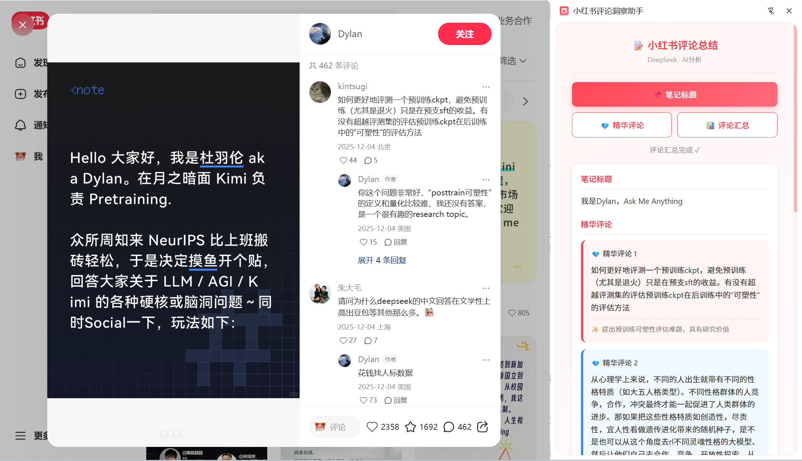
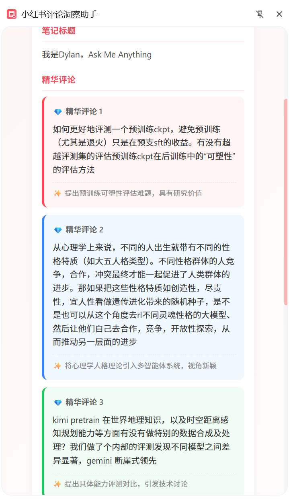
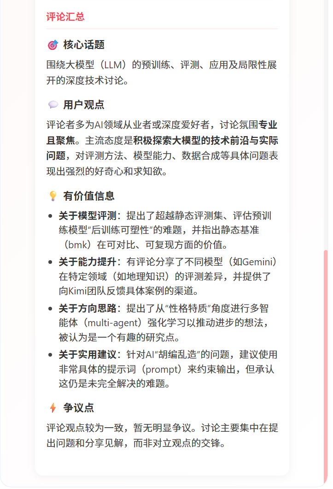

# 小红书评论总结

一款 Chrome 浏览器插件，基于 DeepSeek AI，帮助你快速提取小红书笔记标题、筛选精华评论、生成评论汇总分析。

## 功能特点

- 📌 **笔记标题提取**：一键提取当前笔记的标题
- 💎 **精华评论筛选**：AI 从前 20 条评论中筛选出最有价值的 3 条，以卡片形式展示
- 📊 **评论汇总分析**：AI 分析评论区内容，从核心话题、用户观点、有价值信息、争议点四个维度进行总结
- 🎨 **Markdown 渲染**：完美显示格式化内容，支持标题、加粗、列表等
- ⚡ **即开即用**：无需刷新页面，打开侧边栏即可使用
- 💾 **数据暂存**：支持暂存多篇笔记的分析结果，本地持久化存储（最大100条）
- 📤 **批量导出**：支持选择多个分析结果批量导出为Excel格式
- 🗑️ **数据管理**：可视化界面管理暂存数据，支持筛选、删除、清空等操作

## 效果预览
<p align="center">
  
</p>

<p align="center">
  
  
</p>

## 安装步骤

### 1. 准备图标文件

1. 打开 `icons/generate-icons.html` 文件（用浏览器打开）
2. 点击「下载全部图标」按钮
3. 将下载的 3 个图标文件移动到 `icons` 文件夹中

### 2. 配置 API Key

1. 复制 `config.example.js` 文件，重命名为 `config.js`
2. 打开 `config.js` 文件，填入你的 DeepSeek API Key：

```javascript
// ============== 配置文件 ==============
const API_KEY = '在这里填入你的API_KEY';
// =====================================
```

获取 API Key：
1. 访问 [DeepSeek 开放平台](https://platform.deepseek.com/)
2. 注册并登录账号
3. 在控制台创建 API Key

> ⚠️ 注意：`config.js` 已被 `.gitignore` 忽略，不会上传到 GitHub，请放心填写你的 API Key

### 3. 加载插件到 Chrome

1. 打开 Chrome 浏览器，访问 `chrome://extensions/`
2. 开启右上角的「开发者模式」
3. 点击「加载已解压的扩展程序」
4. 选择本插件所在的文件夹（包含 manifest.json 的文件夹）

## 使用方法

1. 打开小红书网站 (https://www.xiaohongshu.com)
2. 进入任意一篇笔记详情页
3. 点击浏览器工具栏的插件图标，打开侧边栏
4. 根据需要点击相应按钮：

| 按钮 | 功能说明 |
|-----|---------|
| 📌 **笔记标题** | 提取并显示当前笔记的标题 |
| 💎 **精华评论** | AI 从前 20 条评论中筛选最有价值的 3 条，展示评论内容和价值点 |
| 📊 **评论汇总** | AI 分析评论区，生成核心话题、用户观点、有价值信息、争议点的汇总 |

## 界面预览

插件侧边栏包含：
- **顶部标题**：小红书评论总结 (DeepSeek · AI分析)
- **功能按钮区**：笔记标题、精华评论、评论汇总三个主要功能按钮
- **数据管理区**：暂存当前结果、查看已存数据、导出选中数据、清空全部数据
- **状态提示**：显示当前操作状态
- **结果展示区**：展示提取和分析的内容

## 数据管理功能

### 数据暂存
- 点击「暂存当前结果」可保存当前的分析结果
- 支持分别暂存精华评论和汇总分析
- 数据本地存储，关闭插件后仍然保留
- 最多支持暂存100条数据

### 数据查看与管理
- 点击「查看已存数据」打开数据管理界面
- 显示所有暂存的数据列表，包含笔记标题、类型、保存时间
- 支持按类型筛选（全部/精华评论/汇总分析）
- 支持单条删除和全部清空操作

### 批量导出
- 在数据管理界面选择要导出的数据
- 点击「导出选中数据」生成Excel文件
- 支持「导出全部数据」一键导出所有暂存数据
- Excel格式优化，一行一条记录，便于数据处理和分析

## 文件结构

```
xhs_comment_insight/
├── manifest.json        # 插件配置文件
├── background.js        # 后台服务脚本
├── content.js           # 内容脚本（页面 DOM 提取）
├── sidepanel.html       # 侧边栏页面
├── sidepanel.css        # 侧边栏样式
├── sidepanel.js         # 侧边栏逻辑与 API 调用
├── lib/
│   ├── marked.min.js    # Markdown 渲染库
│   └── xlsx.full.min.js # Excel 导出库
├── icons/               # 图标文件夹
│   ├── generate-icons.html  # 图标生成工具
│   ├── icon16.png       # 16x16 图标
│   ├── icon48.png       # 48x48 图标
│   └── icon128.png      # 128x128 图标
├── image_preview/       # 预览图片
├── config.js            # API 配置文件（被 gitignore）
├── config.example.js    # API 配置示例文件
├── test_data_persistence.html  # 数据持久化测试页面
├── CHANGELOG.md         # 更新日志
├── README_NEW_FEATURES.md # 新功能说明
└── README.md            # 说明文档
```

## 技术说明

- **Chrome API**: Side Panel API, Tabs API, Scripting API, Storage API, Downloads API
- **AI 模型**: DeepSeek Chat (deepseek-chat)
- **Markdown 渲染**: marked.js
- **Excel 导出**: xlsx.js
- **数据存储**: Chrome Storage API（本地持久化）
- **最低 Chrome 版本**: 114+

## 注意事项

1. 本插件仅在小红书网站 (xiaohongshu.com) 上可用
2. 需要有效的 DeepSeek API Key 才能使用 AI 功能
3. API 调用会产生费用，请注意控制使用量
4. 评论提取依赖页面 DOM 结构，如小红书更新页面结构可能需要调整选择器

## 常见问题

**Q: 点击插件图标没有反应？**  
A: 确保当前页面是小红书网站，并且 Chrome 版本 >= 114。

**Q: 显示「未找到评论」？**  
A: 请确保当前笔记有评论，且评论区已加载完成。

**Q: API 调用失败？**  
A: 请检查 `sidepanel.js` 中的 API Key 是否正确配置，以及网络是否正常。

**Q: 精华评论或汇总内容为空？**
A: 可能是 API 返回异常，请打开浏览器开发者工具查看控制台日志。

**Q: 数据暂存功能无法使用？**
A: 请检查浏览器是否允许插件使用存储权限，或尝试重新加载插件。

**Q: 导出Excel失败？**
A: 请确保已选择要导出的数据，并检查浏览器下载权限设置。

**Q: 已暂存的数据消失了？**
A: Chrome存储空间可能已满，建议定期导出重要数据。暂存数据最多支持100条。

## 更新日志

### v2.0.0（最新版本）
- 新增数据暂存功能，支持保存多篇笔记分析结果
- 新增批量导出功能，支持选择多个结果导出为Excel
- 新增数据管理界面，支持查看、筛选、删除暂存数据
- 集成Chrome Storage API实现数据持久化存储
- 优化精华评论筛选逻辑（从前20条中筛选3条）
- 更新UI界面，新增数据管理区域

### v1.0.0
- 初始版本发布
- 支持笔记标题提取
- 支持精华评论筛选（3 条卡片展示）
- 支持评论汇总分析（4 维度 Markdown 格式）
- 自动注入 content script，无需刷新页面

## License

MIT License

---

# Xiaohongshu Comment Summary (English)

A Chrome browser extension powered by DeepSeek AI that helps you quickly extract Xiaohongshu (Little Red Book) note titles, filter key comments, and generate comment analysis summaries.

## Features

- 📌 **Note Title Extraction**: One-click extraction of the current note's title
- 💎 **Key Comments Selection**: AI selects the 3 most valuable comments from the top 20, displayed as cards
- 📊 **Comment Summary Analysis**: AI analyzes comment section content from four dimensions: core topic, user opinions, valuable information, and controversy points
- 🎨 **Markdown Rendering**: Perfect display of formatted content, supporting headings, bold text, lists, etc.
- ⚡ **Ready to Use**: No page refresh needed, just open the sidebar and start using

## Preview Image
<p align="center">
  
</p>

<p align="center">
  
  
</p>

## Installation

### 1. Prepare Icon Files

1. Open `icons/generate-icons.html` file in your browser
2. Click the "Download All Icons" button
3. Move the 3 downloaded icon files to the `icons` folder

### 2. Configure API Key

1. Copy `config.example.js` and rename it to `config.js`
2. Open `config.js` file and enter your DeepSeek API Key:

```javascript
// ============== Configuration ==============
const API_KEY = 'Enter your API_KEY here';
// ===========================================
```

To get an API Key:
1. Visit [DeepSeek Open Platform](https://platform.deepseek.com/)
2. Register and log in
3. Create an API Key in the console

> ⚠️ Note: `config.js` is ignored by `.gitignore` and won't be uploaded to GitHub. Feel free to enter your API Key

### 3. Load Extension to Chrome

1. Open Chrome browser, visit `chrome://extensions/`
2. Enable "Developer mode" in the top right corner
3. Click "Load unpacked"
4. Select the folder containing this extension (the folder with manifest.json)

## Usage

1. Open Xiaohongshu website (https://www.xiaohongshu.com)
2. Navigate to any note detail page
3. Click the extension icon in the browser toolbar to open the sidebar
4. Click the corresponding button as needed:

| Button | Description |
|--------|-------------|
| 📌 **Note Title** | Extract and display the current note's title |
| 💎 **Key Comments** | AI selects the 3 most valuable comments from top 20, showing content and value points |
| 📊 **Comment Summary** | AI analyzes the comment section, generating summary of core topic, user opinions, valuable info, and controversy |

## Interface Preview

The extension sidebar contains:
- **Header**: Xiaohongshu Comment Summary (DeepSeek · AI Analysis)
- **Function Buttons**: Three function buttons
- **Status Hint**: Displays current operation status
- **Result Display Area**: Shows extracted and analyzed content

## File Structure

```
xhs_comment_insight/
├── manifest.json        # Extension configuration
├── background.js        # Background service worker
├── content.js           # Content script (page DOM extraction)
├── sidepanel.html       # Sidebar page
├── sidepanel.css        # Sidebar styles
├── sidepanel.js         # Sidebar logic and API calls
├── lib/
│   └── marked.min.js    # Markdown rendering library
├── icons/               # Icon folder
│   ├── generate-icons.html  # Icon generator tool
│   ├── icon16.png       # 16x16 icon
│   ├── icon48.png       # 48x48 icon
│   └── icon128.png      # 128x128 icon
└── README.md            # Documentation
```

## Technical Details

- **Chrome API**: Side Panel API, Tabs API, Scripting API
- **AI Model**: DeepSeek Chat (deepseek-chat)
- **Markdown Rendering**: marked.js
- **Minimum Chrome Version**: 114+

## Notes

1. This extension only works on Xiaohongshu website (xiaohongshu.com)
2. A valid DeepSeek API Key is required for AI features
3. API calls incur costs, please monitor your usage
4. Comment extraction depends on page DOM structure; if Xiaohongshu updates their page structure, selectors may need adjustment

## FAQ

**Q: Clicking the extension icon does nothing?**  
A: Make sure the current page is Xiaohongshu website and Chrome version >= 114.

**Q: Shows "No comments found"?**  
A: Make sure the current note has comments and the comment section is fully loaded.

**Q: API call failed?**  
A: Check if the API Key in `sidepanel.js` is correctly configured and if the network is working.

**Q: Key comments or summary content is empty?**  
A: API may have returned an error. Open browser developer tools to check console logs.

## Changelog

### v1.0.0
- Initial release
- Support for note title extraction
- Support for key comments selection (3 cards display)
- Support for comment summary analysis (4-dimension Markdown format)
- Auto-inject content script, no page refresh needed

## License

MIT License
